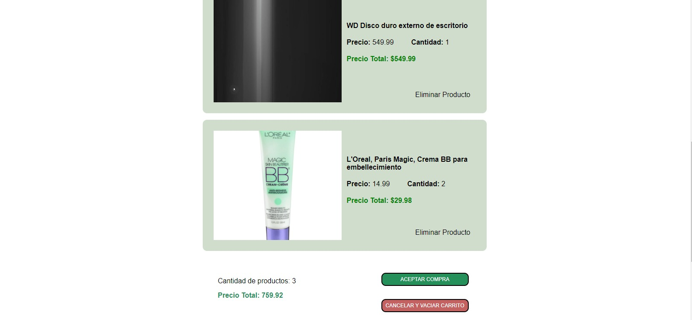

# Práctica de Proyecto Final de Programacion Web

Web de Prototipo

Pagina Web de un Carrito de Compras

## Componentes

+Angular 16.2.11

+Java JDK 17, JPA, Servicios Rest

+Servidor WildFly 29.0.0

+Base de Datos PostgreSQL 16.1

## Descripción

Repositorio principal: https://github.com/sebastoledo98/ProyectoFinal

Este proyecto se basó en el diseño realizado en figma (https://www.figma.com/file/F8ukMn0eseL4TcH0FMLlhF/Prototipado_Carro_Compras?type=design&node-id=0%3A1&mode=design&t=nYylKJ7kWV5OeFTC-1) para su implementación. Se creo un frontend en Angular para el funcionamiento y el diseño, para el backend se creó un proyecto en eclipse con Maven y arquitectura de jakarta para apliaciones web, para el despliege de la apliación en Java se utilizó un servidor WildFly configurado para tener conexión con la base de datos de PostgreSQL.

El trabajo al inicio se diviió en dos repositorios para tener separadas las dos partes y trabajar de forma independiente en ellas, pero al final decidimos juntarlas en un solo repositorio principal para conveniencia.

### FRONTEND

Repositorio princpal del frontend: https://github.com/dfao2003/WebCompras

En cuanto a la parte del Angular se realizó con la ayuda de flexbox en CSS para crear un diseño responsivo, con la ayuda del media screen pudimos diseñar el modelo de forma que se altere según el tamaño de la pantalla y que se pueda desplegar en los distintos dispositivos que existen.

Para la organización del frontend se reconocieron tres partes: páginas, header, footer; esto nos permitió poder utilizar un solo header y footer para desplegar en la vista de todos los componente sin necesidad de repetirlos para cada uno de ellos.

Se comunica con el servidor de WildFly mediante servicios REST, invocando los servicios y enviando datos mediante parámetros en la URL o mediante objetos JSON que luego se mapean a clases creadas en la parte de Java.

En la parte de servicios cabe recalcar que se crearon 4: categorias, productos, transacciones y usuarios. Cada uno de estos nos permitió realizar la parte mas importante: la de conectar el frontend con el servidor wildfly asi pudiendo obtener, eliminar o agregar datos en la base de datos.

[Pagina de los producto](Capturas/producto.jpg)

Como ejemplo mostraremos lo hecho en el servicio llamado transacciones debido a que este es el más elemental al momento de realizar el carrito. En este podemos encontrar funciones como getDetalles, putDetalles, getCarroUsuario, deleteDetalleUsuario, etc. estos serán ultilizados en carrito.component.ts donde se le agregarán los datos necesarios provenientes desde la interfaz del usuario.

### BACKEND

En la parte de backend se realizaron todas las clases que representan los dominios en la parte de frontend, y para cada uno se crearon clases de DAO y de Gestión, así como servicios básicos de POST, PUT, GET Y DELETE para ser consumidos y probar su funcionalidad. Se utilizó la librería de jakarta para las anotaciones de persistencia y de los servicios REST.

Se utilizó un servidor de WildFly para el despliege de la apliación web, y se configuró al servidor para tener una conexión con la base de PostgreSQL y que se eliga esta para la persistencia de los datos. Esto se realizó en el archivo standalone.xml dentro de la carpeta standalone/configuration del servidor de WildFly, además se agregaron drivers para poder realizar la conexión con una base de PostgreSQL.

Para habilitar la conexión con Postgres se configuró al proyecto para que tenga acceso directo a una base ya creada y se dieron las credenciales para poder acceder a la base.

En cuanto a código, cada parte de la aplicación se separaron en paquetes para tenerlos organizados: el paquete de modelos que contiene todas las entidades y su configuración de relaciones y campos para la persistencia en la base de datos, el paquete dao que contiene todos los daos de los modelos, estos realizan la persistencia de los datos y hacen consultas directas con la base de datos para obtener valores y eliminar o actualizar algunos valores, el paquete de servicios que contiene configuración para habilitar la comunicación mediante servicios REST y la definición de los servicios para que sean consumidos en la parte del frontend, y el paquete de gestión que permite la interacción entre las clases del dao y los servicios REST que se consumen.

En la clase CORSFilter se realizan la configuración de la aplicación para habilitar los servicios REST.

En la clase GestionDatos existen datos que se crean al inicio de la base si es que se requiere realizar pruebas de funcionamiento.

En la clase ServicioTransacciones está realizada la mayoría de la lógica para la comunicación mediante servicios REST, aquí es en donde la mayor parte de servicios importantes están definidos, estos servicios no reciben objetos JSON, reciben solo parámetros y realizan transacciones entre los valores ya guardados en la base, y dan respuestas en formato JSON para conveniencia de la parte de frontend.

Repositorios en Github:

Repositorio del proyecto en angular: 
https://github.com/dfao2003/WebCompras

Repositorio del proyecto en Java
https://github.com/sebastoledo98/ProyectoFinal

Conclusiónes:

En este proyecto hemos aplicado los conocimientos adquiridos durante todo el ciclo de la materia de Programación Web, pero también hemos adquirido bastante conocimiento al momento de buscar otras formas y funciones relacionadas con los servicios REST y la comunicación con estos, así mismo al momento de solucionar los diferentes errores que se generaban. Este proyecto ha sido muy interesante realizarlo ya que al final logramos entender como se comportan las páginas ya aplicaciones web, como se puede realizar la comunicación entre frontend y backend, y como se puede conectar a una base de datos externa para tener una persistencia de datos.

